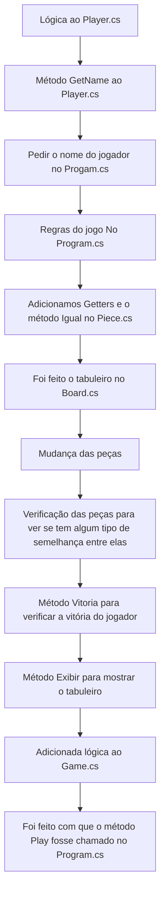

# Jogo da Velha

## Fluxograma

```mermaid
  flowchart TD;
      A[Lógica ao Player.cs]-->B[Método GetName ao Player.cs];
      B-->C[Pedir o nome do jogador no Progam.cs];
      C-->D[Regras do jogo No Program.cs];  
      D-->E[Adicionamos Getters e o método Igual no Piece.cs];
      E-->F[Foi feito o tabuleiro no Board.cs];
      F-->G[Mudança das peças];
      G-->H[Verificação das peças para ver se tem algum tipo de semelhança entre elas];
      H-->I[Método Vitoria para verificar a vitória do jogador];
      I-->J[Método Exibir para mostrar o tabuleiro];
      J-->K[Adicionada lógica ao Game.cs];
      K-->L[Foi feito com que o método Play fosse chamado no Program.cs];  
```
