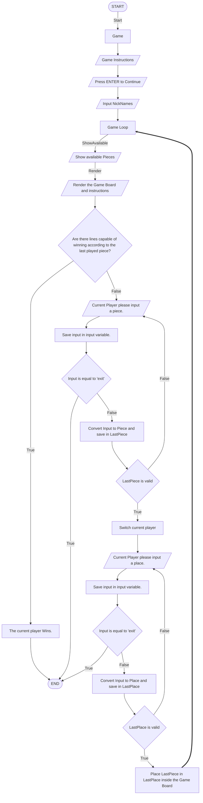

# Jogo da Velha 🐔

#### Flowchart

```mermaid
flowchart TD;
    S([START]) -- Start --> G[Game];
    G --> Ins[/Game Instructions/];
    Ins --> PEnter[/Press ENTER to Continue/];
    PEnter --> Nick[/Input NickNames/];
    Nick --> GL[Game Loop];

    GL -- ShowAvailable --> SA[/Show available Pieces/];
    SA -- Render --> R[/Render the Game Board and instructions/];
    R --> If{Are there lines capable of winning according to the last played piece?};
    
    If -- True --> Win[The current player Wins.] --> E([END]);
    If -- False --> InpPiece[/Current Player please input a piece./] --> Input[Save input in input variable.] --> If2{Input is equal to 'exit'};

    If2 -- True --> E([END]);
    If2 -- False --> ConPiece[Convert Input to Piece and save in LastPiece] --> If3{LastPiece is valid};

    If3 -- False --> InpPiece;
    If3 -- True --> Switch[Switch current player];
    
    Switch --> InpPlace[/Current Player please input a place./] --> Input2[Save input in input variable.] --> If4{Input is equal to 'exit'};

    If4 -- True --> E([END]);
    If4 -- False --> ConPlace[Convert Input to Place and save in LastPlace] --> If5{LastPlace is valid};
    
    If5 -- False --> InpPlace;
    If5 -- True --> Place[Place LastPiece in LastPlace inside the Game Board];
    Place ==> GL;
```